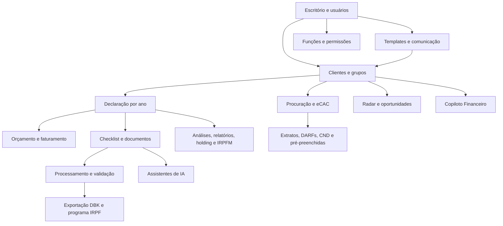

# ConferIR — levantamento funcional para desenvolvimento

**Data da observação:** 05/10/2026, horário de São Paulo.  
**Origem:** portal autenticado em `https://portal.conferironline.com.br`.  
**Restrição respeitada:** leitura e navegação, sem salvar cadastros ou preferências, executar robôs, enviar mensagens, importar arquivos, aprovar orçamentos, contratar serviços ou excluir registros.

Este documento descreve a interface e os fluxos acessíveis na conta utilizada. É uma base para desenvolver um produto com telas e funções equivalentes. Não constitui acesso ao código original, ao banco de dados, às APIs privadas ou às regras internas do fornecedor. Uma reprodução integral precisa completar os pontos de validação indicados ao final.

Os valores, nomes, documentos, emails e identificadores dos clientes foram omitidos do material de especificação. Os exemplos de entidades abaixo são conceituais. A navegação em um perfil existente serviu apenas para observar ferramentas.

## 1. Arquivos do levantamento

| Arquivo | Uso |
| --- | --- |
| `relatorio.html` | Catálogo pesquisável das telas, campos, ações e variáveis dos templates |
| `inventario.json` | Observações estruturadas, rotas normalizadas e elementos encontrados |
| `ESPECIFICACAO.md` | Explicação dos módulos, fluxos, dependências e proposta de implementação |
| `evidencias/` | Quatro referências visuais, sem listagens de clientes ou credenciais |
| `referencias-css/` | Estilos que o navegador observou; referência da interface, sem JavaScript da aplicação |

Uma rota pode apresentar vários estados e formulários. As observações do inventário incluem esses estados; elas não devem ser contadas como páginas independentes. Alguns componentes mantêm campos ocultos no DOM: sua presença confirma uma definição de interface, mas não confirma execução, disponibilidade por contrato ou resposta do servidor.

## 2. Organização geral

O portal atende escritórios contábeis que acompanham clientes, declarações, documentos, procurações, impostos e honorários. A entidade central é o cliente, associado a um responsável, procurador, grupo e ano de declaração.

O fluxo acima é uma síntese das relações observadas na interface, não um diagrama do banco de dados original.

### Navegação principal

| Grupo | Ferramentas e destinos |
| --- | --- |
| Início | Dashboard `/dashboard`, Kanban `/dashboard/kanban`, Radar `/dashboard/insights` |
| Clientes | `/customers`; novos clientes, atualização cadastral, procuração e INSS em lote |
| Financeiro | Métodos de pagamento, tabelas de cobrança, orçamento em lote, faturamento |
| Emails | Templates, emails enviados e backup |
| Relatórios | Faturamento, resultados, documentos faltantes e restituição |
| Administrador | Empresa, colaboradores, grupos, funções, contratos, Copiloto e integrações |
| Elaboração | Fila de documentos e exportação de declarações |
| Pré-preenchidas IRPF | Arquivos obtidos a partir de procurações e robô |
| Central de Downloads | Sincronizador e extensão do navegador |
| Conta | Dados do usuário, autenticação do procurador, permissões e notificações |

### Elementos globais

O cabeçalho oferece pesquisa por nome, CPF e email, acionada por Enter. Há um comando de sincronização eCAC, área de ajuda, notificações e menu do usuário. O menu pessoal apresenta Detalhes, Preferências e Sair. A tela de preferências controla notificações por dispositivo e por conta, com ação de revogação geral. Essas opções não foram alteradas.

Breadcrumbs indicam contexto; uma estrela aparece como possível atalho/favorito, sem teste de persistência. O rodapé oferece downloads, suporte por WhatsApp e um widget Freshworks/Freshdesk com artigos e contato. Não houve envio de ticket, mensagem ou consulta de IA.

## 3. Dashboard, Kanban e Radar

### Dashboard global

A seleção de ano exercício organiza indicadores de imposto a pagar e restituir, clientes ativos, declarações, transmitidas e finalizadas. Os alertas incluem saldo negativo, malha fina, atrasos de DARF e IRPFM.

Há gráficos para procurações, autenticação do procurador, situação eCAC, processo interno das declarações, CND, tributação, orçamento e bens e direitos. Alguns gráficos permitem alternar apresentação. Um aviso inicial reúne comunicados e treinamentos, com opção de não exibição futura; essa preferência não foi marcada.

### Kanban

Filtros: grupo de clientes, nome/CPF/email e ano. Existe atualização da visualização. Cartões identificam o cliente e têm associação a grupo.

| Etapa principal | Subestados observados |
| --- | --- |
| Não iniciado | Não iniciado |
| Negociação / orçamento | Enviado, aprovado |
| Em preenchimento | Iniciado, elaboração, documentos faltantes |
| Transmitida / eCAC | Desconhecido, aguardando, em processamento, malha fina, restituição, processadas |
| Finalizado | Finalizado |

Arrastar cartões não foi testado. A existência e a persistência de transições por arraste devem ser verificadas em ambiente de teste.

### Radar de oportunidades

A tela agrega clientes e insights, permite atualização de dados, consulta dos clientes de uma oportunidade e início de campanha. A conta exibiu categorias de alto patrimônio e criptoativos. A explicação do produto também lista renda variável, atividade rural, Carnê-Leão, possível abertura de empresa e novos insights.

Estados de acompanhamento anunciados: aberto, em andamento, concluído e dispensado. A ajuda informa que o Radar mantém oportunidades ativas. A preferência do escritório inclui uma base configurável para alto patrimônio. As fórmulas de classificação das demais categorias e a geração de campanhas não foram executadas.

## 4. Clientes e cadastros

### Listagem

A listagem usa cartões com identificação, CPF, email e observações. Há seleção individual/coletiva, paginação e acesso ao perfil, inclusive em nova aba.

Filtros observados:

- Ano calendário, responsável e grupos.
- Com/sem email; ativo/inativo.
- Com/sem procurador; procuração em validação, válida, inválida, sem permissões, expirada, cancelada, negada ou pendente.
- Mensagem na caixa postal, exigência de nível Gov.br e vencimento da procuração nos próximos 30 dias.
- CND com sucesso, CPF inválido, CPF não localizado ou necessidade de analisar pendências no eCAC.

Ações coletivas apresentadas: kit pós-declaração, mala direta, etiquetas, status, procurador, responsável, grupos, exportação para Excel, download de documentos e exclusão dos selecionados. Somente o menu foi aberto; nenhuma operação coletiva foi executada.

### Cadastro novo

O modal apresenta nome, CPF, email e responsável. O botão de inclusão começa desabilitado. A tela sinaliza obrigatoriedade de nome; a importação em lote exige também CPF e email do responsável. As demais regras de validação do servidor não foram exercitadas.

### Perfil do cliente

Abas: Dashboard, IRPF, IA, Ecac, Ações - Ecac, Identificação, Endereço, IRPFM, Copiloto Financeiro, Livro Caixa e Mensagens.

O dashboard individual resume status interno, status eCAC e procuração, caixa, imposto, variação patrimonial, saúde, dependentes, rendimentos, educação e distribuição dos bens. Há seleção de ano e comando de finalização da declaração, que não foi acionado.

| Cadastro | Campos observados |
| --- | --- |
| Identificação | Nome, CPF/CNPJ desabilitado, título de eleitor, nascimento, sexo, email, códigos de país, celular, telefone, grupo, responsável, status, procurador e observação |
| Endereço principal/secundário | Endereço, número, complemento, cidade, bairro e CEP |
| Acesso do cliente | Comando para gerar acesso ao portal; não acionado |

## 5. Processo de IRPF

O módulo possui quatro etapas: orçamento, documentação, DARF e relatórios. Atalhos complementares levam a documentos faltantes, holding e Cloud.IA. O ano exercício aparece no contexto.

### Orçamento e faturamento

O formulário de orçamento contém:

- Tipo, status, categoria e descrição.
- Tabela de cobrança opcional e valor.
- Forma de pagamento, início da cobrança, parcelas e desconto percentual.
- Observação interna e opção de envio por email.

A interface apresenta uma referência do orçamento anterior. **Regra explicitamente exibida:** o faturamento é criado quando o orçamento é aprovado. Os detalhes da aprovação, edição de faturamentos, recebimento e geração/envio de recibos constam da matriz de permissões, mas não puderam ser exercitados no perfil sem orçamento utilizado na leitura.

### Documentação e checklist

São oferecidos checklist digital e PDF. A interface organiza o digital em identificação, familiares, rendimentos, pagamentos, bens e dívidas, atividade rural, arquivos e resumo. O PDF oferece download e entrega por email/WhatsApp, sujeitos à disponibilidade de contato.

A criação do digital depende do XML do ano anterior: o portal orienta atualizar e sincronizar esse XML antes de criar o checklist; alterações posteriores no XML não atualizam automaticamente o checklist já gerado. A criação não foi acionada.

A [ajuda do fornecedor para o cliente](https://conferir.freshdesk.com/support/solutions/articles/151000030977-checklist-digital-dirpf-cliente) descreve anexos de PDF, imagens e planilhas; campos por titular/dependente; itens mantidos ou removidos em relação ao ano anterior; observações e inclusão de novos documentos. Ela descreve finalização por seção, distinguindo conclusão, documentos pendentes e ausência de documentos, com notificações ao contador nas situações indicadas.

Há uma diferença a validar: o artigo descreve um link individual sem login/senha e sem expiração, enquanto o template de email menciona CPF e código de validação. A sessão não permitiu confirmar a experiência atual do destinatário sem criar ou gerar novo acesso. Não se deve escolher um desses mecanismos como definitivo apenas com este levantamento.

### Documentos faltantes

A tabela usa descrição, criação, limite, baixa e opções. Um novo item solicita descrição e data limite. Há envio por email e WhatsApp, desabilitado quando não há itens elegíveis. Não foram criadas ou baixadas pendências.

### DARF

A tabela apresenta valor, vencimento, status da parcela, status do envio e PDF. O portal indica procuração válida como requisito para o robô acompanhar as quotas. Geração, envio automático e conferência de pagamento não foram executados.

### Relatórios individuais

Tipos observados: análise de caixa, detalhes do caixa, histórico patrimonial, histórico do caixa, aviso de malha fina, planejamento tributário e bens/direitos. Opções: dados do cônjuge, saída em PDF ou Excel, email e WhatsApp.

A interface recomenda XML do exercício disponível e logo adequado para geração. A área de outros gastos contém totais de pagamentos, principal, juros, despesas de cartão e perdas de capital. Os campos foram apenas lidos.

### Holding

A simulação mostra imóveis utilizados, patrimônio declarado, aluguel mensal, valor destinado à holding, ITBI, economia estimada e comparação de custos entre pessoa física/outros tipos de empresa e holding. As linhas incluem ITBI, cartório, ganho de capital, IR anual, estimativa de dez anos e inventário. Há gestão dos bens e geração de PDF.

O modal de bens estava vazio no perfil observado. Nenhum percentual, valor ou seleção patrimonial foi alterado. O cálculo efetivo, os defaults e a inclusão de imóveis precisam de validação específica.

### IRPFM

A tela mostra enquadramento, rendimentos, base, limite, excesso, imposto bruto, imposto já pago, imposto complementar e alíquota efetiva. O detalhamento separa resumo, composição de rendimentos, exclusões, base, alíquota, imposto bruto, deduções, redutor, imposto complementar e conclusão. Oferece download e impressão.

Um assistente acompanha a tela e oferece atalhos de perguntas, anexos e arquivos do checklist. Nenhum atalho que envia consulta foi acionado. A leitura mostra a estrutura do demonstrativo; não verifica conformidade tributária nem recupera a implementação das fórmulas.

## 6. eCAC, procurações e pré-preenchidas

### Conta/procurador

Há identificação por CPF/CNPJ, tipo de autenticação, senha de instalação e arquivo de certificado. Nome e email do usuário são somente leitura. O portal explica três formas de acesso: Gov.br, certificado instalado localmente e certificado enviado aos servidores. O processamento automático anunciado com certificado armazenado é voltado ao A1; outros modelos dependem da extensão e de uso diário, segundo o texto da tela.

Nenhuma credencial foi revelada, extraída, digitada, removida ou salva. O botão da nuvem para sincronização não foi acionado.

### Cliente / Ecac

A tela apresenta login e senha mascarados e painéis para declarações processadas, extratos de rendimentos, DARF, CND e status simplificado.

| Painel | Estrutura observada |
| --- | --- |
| Declarações processadas | Ano, status, tipo, original/retificadora, tributação e opções |
| Extratos de rendimento | Ano, data de emissão e visualização |
| DARF | Valor, vencimento, status da quota/envio e PDF |
| CND | Dependência da preferência do escritório para geração automática |
| Status simplificado | Tutorial e orientação de aguardar processamento pelo robô |

A tela afirma que o robô processa declarações de clientes com autenticação válida. Ações - Ecac oferece Carnê-Leão, Meu IRPF, CND e Fontes Pagadoras por automação da extensão. Não houve abertura dessas sessões externas.

### Pré-preenchidas

O fluxo documentado é: cadastrar procurador → associar clientes → solicitar validação/sincronização → robô busca arquivos → disponibilizar downloads → restaurar arquivos no programa IRPF. Clientes sem associação ao procurador são ignorados pela busca.

Há download individual e em lote. O lote usa ZIP. “Baixar Novos” considera arquivos ainda não baixados; “Baixar Todos” inclui os anteriores. A existência de controle de download é sugerida pela interface, e esses botões não foram executados para preservar o estado da conta.

## 7. Elaboração e exportação

A central permite pesquisa de cliente, filtro de status e seleção coletiva. Colunas: seleção, cliente, CPF, arquivos processados, status, exportação e opções.

Estados descritos: sem arquivos, arquivos não processados, conflito nas informações, aguardando validação, processamento OK e já exportada. O portal documenta exportação dos selecionados, processamento assíncrono, disponibilização de download por linha e download em lote. O formato anunciado é DBK, restaurado no programa IRPF em cópias de segurança.

O ícone de opções leva ao checklist do cliente. Não houve processamento, validação ou exportação. A resolução de conflitos e a estrutura dos arquivos DBK não foram inspecionadas por meio de execução.

## 8. IA, Livro Caixa, Mensagens e Copiloto

### IA

O seletor apresenta especialistas em IR, malha fina, ganho de capital e assessor financeiro. IR e ganho de capital têm interface de conversa, anexos e reinício; malha fina também anuncia geração de defesa administrativa. Nenhuma conversa foi reiniciada ou consulta enviada.

O assessor financeiro usa seleção de documentos, limitada a dez arquivos segundo a tela, geração de análise, PDF, avaliação e reprodução da análise. Esse fluxo é distinto dos chats. Documentos e análises não foram gerados. Modelos, prompts, provedores, retenção e qualidade das respostas não são observáveis a partir destas telas.

### Livro Caixa

Etapas apresentadas: download de modelos, guia de preenchimento, conversão e importação. Os modelos abrangem rendimentos, aluguel/pensão/outros, serviços notariais e trabalho não assalariado; pagamentos gerais e plano de contas padrão.

O guia contém referências de campos e tabelas de códigos de rendimentos, pagamentos e ocupações. As instruções de importação descrevem CSV separado por ponto e vírgula, máximo de mil linhas e inclusão de novos lançamentos sem sobrescrever os anteriores. Há tutorial para uso da extensão no Carnê-Leão.

As etapas seguintes estão condicionadas ao fluxo de arquivos. Nenhum arquivo foi selecionado, convertido ou importado.

### Mensagens

Existe conversa no contexto do cliente com campo de mensagem e controles de comunicação. O mecanismo de entrega e a integração com WhatsApp não foram testados. Não houve digitação ou envio.

### Copiloto Financeiro

A conta mostrou um bloqueio comercial de contratação. A interface acessível anuncia visão geral, orçamento, vencimentos, seguros, IRPFM, exterior, assessor financeiro, Copiloto e documentos. Apresenta meses, receitas, despesas, saldo, taxa de poupança, pendências e projeção fiscal.

Esses elementos foram catalogados como apresentação parcial. Fluxos de lançamento, edição, análise e anexos ficaram inacessíveis pelo plano. A administração lista clientes habilitados e limite do plano, com nome, CPF/CNPJ, email, situação e opções. Não houve ativação de cliente nem contratação.

## 9. Financeiro e relatórios gerais

### Métodos de pagamento

Tabela: nome, tipo, máximo de parcelas, status, padrão e opções. Formulário: tipo, nome, máximo de parcelas, status e definição de padrão. O formulário novo foi aberto e fechado vazio.

### Tabelas de cobrança

Tabela: nome, tipo, ativo, padrão e opções. Formulário: nome, tipo, status, datas de validade e padrão. Tipos apresentados no seletor: fixa, variável por hora, variável por itens e percentual.

Campos dependentes do tipo não foram preenchidos nem validados. A semântica de base percentual, itens, arredondamento, mínimo e hora faturável continua pendente.

### Relatórios gerais

| Relatório | Filtros/opções observados |
| --- | --- |
| Faturamento | Ano, categoria, responsável, tipo, status de pagamento, apenas orçamentos aprovados, recibos vencidos |
| Resultados | Ano, a pagar, a restituir, sem pagamento/restituição |
| Documentos faltantes | Apenas pendências com data limite vencida |
| Restituição | Ano, restituições futuras, ordenação por data/nome, Excel |

As telas usam um painel lateral de filtros e um estado vazio antes da geração. Não foram gerados relatórios. A restituição depende da procuração e dos lotes liberados pela Receita, segundo a própria interface.

## 10. Importação em lote

Todas as páginas observadas apresentam download de modelo e área para arrastar/selecionar arquivo. Não houve download de modelo preenchido com dados nem upload.

| Rota | Finalidade | Regra exibida |
| --- | --- | --- |
| `/import-spreadsheet/new-customers` | Novos clientes | Nome, CPF e email do responsável obrigatórios |
| `/import-spreadsheet/update-customer` | Atualização | Telefone, celular e email são os campos indicados para preencher |
| `/import-spreadsheet/procuration` | Associação ao procurador | Campo CPF/CNPJ do procurador |
| `/import-spreadsheet/inss` | Login INSS | A tela solicita senha Gov.br do cliente no modelo |
| `/import-spreadsheet/budget` | Orçamentos | Modelo preenchido com dados existentes de orçamento |

A matriz de permissões também menciona planilha de login eCAC. Essa operação não apareceu entre os destinos atuais do menu observado; não foi localizada nem tratada como página validada.

Layouts exatos dos arquivos, extensões aceitas, regras de duplicidade, erros por linha, atomicidade e recuperação de falhas precisam ser definidos antes da implementação.

## 11. Emails e documentos de comunicação

O editor de templates permite assunto, HTML/texto enriquecido, formatação, links, imagens, vídeos, listas, cores, visualização HTML e restauração do padrão. Nenhum conteúdo foi modificado ou restaurado.

Foram lidos os 14 templates: checklist digital, checklist PDF, DARF, documento cliente, documento faltante, email mensal, marketing, orçamento, orçamento digital, planejamento DIRF, autorização, recibo, tutorial de procuração PF e tutorial WhatsApp.

As variáveis exatas estão em `inventario.json` e no catálogo HTML. Há duas convenções coexistentes: nomes em português (`{{Cliente}}`, `{{Contador}}`) e nomes em inglês (`{{CUSTOMER_NAME}}`, `{{YEAR}}`). É necessário preservar a convenção de cada template se houver compatibilidade com o sistema atual. Existem ainda variáveis específicas de CPF, código, link do formulário, aprovação, categoria, descrição, valor, recibo e contato WhatsApp.

Emails enviados usa tipo de email, datas inicial/final, pesquisa por cliente e paginação. A tabela contém assunto, nome, email, envio, situação e opções. Reenvio, confirmação de entrega e política de erros não foram exercitados.

A opção de backup exibe oferta comercial de backup de declarações. Não foram contratados serviços, realizados pagamentos ou baixados dados de backup. A rotina real de recuperação não estava disponível nesta conta.

## 12. Administração e permissões

### Empresa e preferências

A empresa permite logo e website. Preferências incluem:

- Restrição de visibilidade dos clientes por contador.
- Envio automático de DARF e notificações eCAC ao email principal.
- Consulta simplificada sem procurador e geração automática de CND.
- Duas vias/detalhes do recibo e detalhes/autorização sem orçamento.
- Método de desconto simplificado na análise de caixa.
- Checklist em modo consulta e bloqueio por status da declaração.
- Base patrimonial do Radar.
- Cores de título, subtítulo e linhas dos relatórios.

Os textos e controles foram registrados; estados visuais de marcação não foram tratados como prova de configuração ativa. Nenhuma preferência foi salva.

### Cadastros administrativos

| Área | Estrutura |
| --- | --- |
| Colaboradores | Nome, email, função; criar, editar e excluir |
| Grupos | Nome; criar e administrar grupos |
| Funções | Nome e seleção de permissões por categoria |
| Contratos | Pacote, início/expiração, ano, backup, situação e termo |
| Plano Copiloto | Limite, habilitados e situação por cliente |
| Integrações | Asaas, Omie e WhatsApp |

As integrações anunciam cobrança e troca de mensagens. Nenhum botão Integrar foi acionado; autenticação, campos, contratos de API e webhooks não foram obtidos.

### Matriz de acesso

As definições visíveis cobrem clientes, colaboradores, funções, escritório, configurações, grupos, procuradores, eCAC, checklist digital/PDF, pré-declaração, kit pós-declaração, mala direta, orçamento, faturamento, recibos, relatórios, importações, métodos de pagamento, templates e tabelas de cobrança.

A granularidade distingue listar, criar, editar, excluir, enviar, fazer upload/download, aprovar, receber e gerar documentos. A conta de administrador exibe suas permissões na tela de detalhes; o formulário de função permite configurar o conjunto. A enforcement real pelo servidor não foi testada.

## 13. Referência visual

A interface observada usa estrutura de aplicação Angular no DOM, componentes próprios, `ng-select`, modal `ngb` e classes visuais da família Bootstrap. A versão exata do framework não foi identificada. Essa observação não obriga usar a mesma tecnologia na reprodução.

| Elemento | Referência observada |
| --- | --- |
| Corpo | Fonte CSS `work-Sans, sans-serif`, 14 px, texto `#313131` |
| Cor principal | `#3949AB` |
| Fundo | Cinza claro, declarado como `rgba(246,246,246,.6)` no corpo |
| Menu | Faixa vertical escura, ícones brancos, expansão para grupos de links |
| Cabeçalho | Branco, pesquisa arredondada, ícones e avatar |
| Conteúdo | Cartões brancos, espaçamento amplo, sombras leves e bordas arredondadas |
| Botões | Preenchidos ou contornados; modais com cantos de cerca de 6 px nos botões e relatórios com formato pílula |
| Formulários | Rótulo acima, campos em colunas, seletores pesquisáveis, data e valores |
| Perfil do cliente | Identificação fixa e barra horizontal de abas com ícones |
| Relatórios novos | Filtros em drawer à direita, estado vazio central |
| Estados | Carregamento, vazio, ação desabilitada, erro obrigatório e bloqueio comercial |

O viewport registrado foi de 1522 × 640. Breakpoints, comportamento móvel, teclado e acessibilidade não foram auditados. A fonte efetivamente observada como recurso remoto foi Nunito; a captura de estilos declarou Work Sans. Há possível fallback/importação de fontes, a confirmar por comparação visual. A exportação desse arquivo de fonte falhou; três folhas CSS foram salvas.

### Capturas

- `evidencias/central-downloads.jpg`: shell, cards e seleção de plataforma.
- `evidencias/importacao-clientes.jpg`: título, orientações e zona de arquivo.
- `evidencias/formulario-tabela-cobranca.jpg`: modal vazio e composição de campos.
- `evidencias/relatorio-filtros.jpg`: drawer de filtros e estado vazio.

## 14. Proposta técnica para desenvolver a versão equivalente

Esta seção é uma proposta de implementação derivada dos comportamentos observados. Não descreve a arquitetura real do fornecedor.

### Componentes de sistema

1. Aplicação web com shell, abas, filtros, cartões, tabelas, formulários e estados uniformes.
2. Serviço de contas/escritórios com autenticação, isolamento de clientes e autorização por função/operação.
3. Serviço de declarações por exercício, documentação, checklist e validação.
4. Serviço financeiro com orçamento, aprovação, faturamento, parcelas e recibos.
5. Armazenamento privado de documentos e geração de PDFs, planilhas e pacotes de exportação.
6. Fila de tarefas para extração de documentos, análises, exportações, comunicação e conectores.
7. Adaptadores separados para eCAC/automação, Asaas, Omie, WhatsApp e IA.
8. Sincronizador local e extensão, se for necessário reproduzir as operações que dependem do computador do contador.

### Entidades conceituais

| Entidade | Relações e dados mínimos |
| --- | --- |
| Escritório | Preferências, identidade visual, usuários, planos, integrações |
| Usuário/função/permissão | Escritório, responsáveis, operações autorizadas |
| Cliente | Identificação, contatos, endereços, responsável, grupos, procurador |
| Procuração/autenticação | Cliente/procurador, situação, validade, resultados de validação |
| Declaração | Cliente, ano calendário/exercício, estados internos/eCAC, arquivos |
| Checklist/seção/item | Declaração, dados anteriores, estado, observação, anexos, finalização |
| Documento/tarefa | Origem, processamento, erros, vínculo com checklist, exportação |
| Pendência | Declaração, descrição, limite, criação e baixa |
| Orçamento | Cliente, categoria, itens/regras, status, desconto, forma de pagamento |
| Faturamento/parcela/recibo | Orçamento aprovado, vencimentos, recebimentos, comprovantes |
| DARF/CND/extrato | Cliente, ano, documento, status, data de consulta |
| Bem/simulação | Declaração, categoria, valores, participação na análise de holding |
| Template/envio | Tipo, tags, assunto, conteúdo, destino, anexos, estado de entrega |
| Oportunidade | Cliente, categoria, evidências, estado de acompanhamento |
| Conversa/análise IA | Usuário/cliente, contexto, documentos, resultado, avaliação |
| Plano/licença | Limites, datas, recursos disponíveis |

Credenciais e certificados requerem armazenamento protegido, controle de acesso e possibilidade de revogação. O modelo do checklist público deve ser especificado antes de gerar links reais. Estas são necessidades do novo produto, não uma afirmação sobre controles do original.

### Ordem sugerida de construção

| Etapa | Entrega verificável |
| --- | --- |
| 1 — Interface | Shell e catálogo de rotas; telas com dados fictícios, componentes e comparação visual |
| 2 — Base | Escritórios, usuários, permissões, clientes, grupos, cadastros e seleção por ano |
| 3 — Operação IRPF | Estados, checklist, documentos, pendências, elaboração e histórico |
| 4 — Financeiro | Métodos, tabelas, orçamentos, aprovação, faturamento e recibos |
| 5 — Comunicação | Templates, variáveis, histórico e envio somente em ambiente de teste |
| 6 — Análises | Caixa, patrimônio, holding e IRPFM com fórmulas documentadas e casos de referência |
| 7 — Integrações | Filas, eCAC/extensão/sincronizador, pré-preenchidas e plataformas externas |
| 8 — Complementos | Radar, assistentes IA, Livro Caixa, Copiloto e políticas de plano |

### Critérios de aceitação

- Cada rota observada tem tela correspondente, campos, estados vazios/carregando/erro e ações coerentes.
- Nenhum usuário acessa clientes de outro escritório; permissões são verificadas também no servidor.
- Ano e cliente do contexto acompanham navegação, filtros, arquivos e relatórios.
- Orçamento aprovado gera faturamento uma única vez; parcelas e recibos permanecem rastreáveis.
- Checklist preserva dados anteriores, anexos e estados por seção e aplica o bloqueio por status definido.
- Importações produzem resultado por linha, tratamento de duplicidade e recuperação de falha definidos.
- Tarefas têm fila, estado, erro, progresso e resultado; repetições não duplicam envios ou lançamentos.
- Relatórios e cálculos são comparados a exemplos conhecidos, com entradas e fórmulas versionadas por exercício.
- Exportação DBK e CSV é validada com programas oficiais e arquivos de teste antes de uso real.
- Regressões visuais são comparadas no mesmo viewport e em tamanhos menores.

## 15. O que falta para equivalência integral

| Ponto | Situação e próxima evidência necessária |
| --- | --- |
| Backend e APIs | Não acessados; definir contratos para o novo produto |
| Motor tributário | Interface lida; validar fórmulas, arredondamentos, exercício e exemplos de referência |
| eCAC/robô | Dependências identificadas; documentar automações, permissões, falhas e limites sem executar na conta real |
| Checklist do destinatário | Ajuda e template lidos; validar token/código, telas atuais e expiração em conta de teste |
| Aprovação/recebimento | Operações e regra de criação identificadas; observar exemplos em ambiente de teste |
| Cobrança por tipo | Tipos identificados; especificar campos e cálculos dependentes de cada opção |
| Conflitos/documentos | Estados identificados; validar extração, edição, resolução e classificação |
| Integrações | Asaas/Omie/WhatsApp anunciados; especificar configurações e contratos sem habilitar na conta real |
| Copiloto | Bloqueado pelo plano; obter ambiente autorizado com o recurso habilitado |
| Backup | Oferta visível; observar exportação, retenção e restauração em teste |
| IA | Interfaces lidas; modelos/prompts, tratamento de documentos e resultados não validados |
| Recursos antigos | Planilha eCAC e outras permissões podem representar recursos legados; confirmar utilização atual |
| Experiência pública/móvel | Login, recuperação, portal do cliente e responsividade não percorridos integralmente |

O levantamento cobre os destinos encontrados na navegação autenticada e os submódulos acessíveis. Botões que poderiam alterar informações, disparar processamento, conceder acesso ou enviar dados foram preservados. Por isso, o resultado permite iniciar a interface e a especificação do produto, mas não sustenta a afirmação de que toda a lógica interna já foi compreendida ou que uma cópia funcional integral está pronta.
